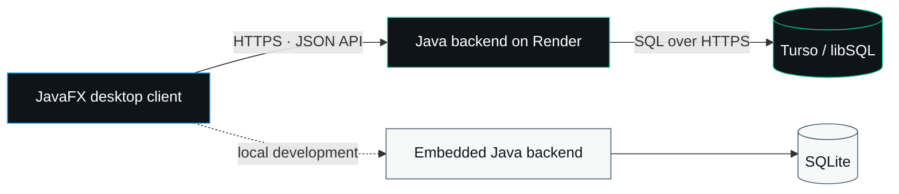

<div align="center">
  

  <br>

  [](https://github.com/Soheil-Aghayani/x-clone/actions/workflows/ci.yml)
  [](https://openjdk.org/projects/jdk/21/)
  [](https://openjfx.io/)
  [](https://maven.apache.org/)
  [](https://render.com/)
  [](https://turso.tech/)

  **A native JavaFX social app inspired by X, with a shared Java backend and Turso database.**

  [Quick start](#quick-start) · [Features](#the-experience) · [Architecture](#architecture) · [Portable build](#portable-windows-build) · [Deployment](DEPLOY-RENDER-TURSO.md)
</div>

---

## The experience

X Clone recreates the main X desktop experience in a native application. It combines a responsive JavaFX interface with real authentication and a shared social API that can run locally with SQLite or publicly on Render with Turso.

| Area | Included |
| --- | --- |
| Home | For You and Following feeds, composer, hashtags, relative timestamps, media/GIF display, and a 280-character limit |
| Profiles | Avatars, banners, bios, follower counts, post history, profile navigation, and follow controls |
| Conversations | Full post threads, nested replies, quote posts, reposts, likes, bookmarks, menus, counters, and interaction animations |
| Discovery | Notifications, mentions, search, trends, news, sports, and entertainment views |
| Living demo network | Ten labelled NPC personalities share one global stream of generated posts, replies, reactions, follows, and views |
| Chat | Passcode flow, inbox filters, message settings, and NPC-only automatic replies |
| International text | Chirp for Latin text and Vazirmatn for Persian and other complex scripts |
| Desktop | Responsive JavaFX layout, X-inspired styling, and a portable Windows package |

<details>
<summary><strong>More UI details</strong></summary>

- Dynamic notification badges in the sidebar and window title
- Clickable avatars, display names, and usernames
- Profile-picture fallbacks and animated GIF media
- Character countdown warnings and disabled posting beyond the limit
- Account menu, password-visibility controls, custom dialogs, and secure chat passcodes
- Empty states for notifications, mentions, bookmarks, and conversations

</details>

## Quick start

### Requirements

- [JDK 21](https://adoptium.net/temurin/releases/?version=21)
- [Maven 3.9+](https://maven.apache.org/download.cgi)

### Run locally

```powershell
git clone https://github.com/Soheil-Aghayani/x-clone.git
cd x-clone
mvn clean javafx:run
```

The desktop app starts an embedded backend automatically. Local accounts and shared-style social data are stored in:

```text
%USERPROFILE%\.x-clone-server\xclone.db
```

Client-only preferences, drafts, chats, and cached media are stored in:

```text
%USERPROFILE%\.x-clone
```

Run all automated tests with:

```powershell
mvn test
```

> [!TIP]
> If PowerShell says `mvn` is not recognized, install Maven, add its `bin` directory to `PATH`, and open a new terminal.

## Architecture



| Layer | Technology | Responsibility |
| --- | --- | --- |
| Desktop | Java 21 + JavaFX 21 | UI, navigation, local preferences, and API calls |
| API | Java HTTP server | Authentication, sessions, profiles, posts, and social interactions |
| Local data | SQLite | Zero-configuration local development |
| Cloud data | Turso / libSQL | Shared SQLite-compatible hosted database |
| Hosting | Render + Docker | Public backend deployment |
| Automation | GitHub Actions | Maven tests and Docker build validation |

## What is shared between computers?

When every desktop client uses the same public backend URL, these features are shared through Turso:

- accounts, sessions, and profiles
- posts, replies, and quote posts
- likes, reposts, and bookmarks
- follow relationships
- notifications, mentions, and read state
- one shared NPC ecosystem that stays consistent for every connected user

These parts remain local to each desktop for now:

- selected local image/GIF files unless the media value is already a public HTTPS URL
- drafts, polls, hidden/muted preferences, and seeded demo content
- chat messages, passcodes, and chat settings

> [!NOTE]
> The backend is now the source of truth for the core social network. Object storage is still needed before files selected from one computer can be viewed on every other computer.

### Living demo network

The backend creates ten clearly labelled automated demo accounts. Their original content is assembled from topic-specific banks covering development, design, science, gaming, sports, photography, music, books, security, and startups. The combinations provide thousands of possible posts.

Every activity interval, the shared backend may publish a post or reply, like, repost, bookmark, follow another demo account, or increase views. Activity is stored in Turso, so all clients see the same posts and engagement instead of receiving separate local simulations. Desktop clients check for shared updates every 45 seconds while the app is open.

The default activity interval is 15 minutes. It can be changed on the backend with `XCLONE_NPC_INTERVAL_SECONDS`; production values are limited to at least 60 seconds. When a free host sleeps, activity safely catches up by a limited number of intervals on the next authenticated sync—no separate cron service is required.

## Portable Windows build

Create a local-only package:

```powershell
.\build-portable.ps1
```

Create a package connected to your public Render backend:

```powershell
.\build-portable.ps1 -ServerUrl "https://YOUR-SERVICE.onrender.com"
```

The shareable archive is generated at:

```text
dist\X-Clone-Windows-Portable.zip
```

Recipients extract the entire folder and run `X Clone.exe`; they do not need Java, Maven, or an IDE.

## Deploy with Render + Turso

The repository contains:

- [`Dockerfile`](Dockerfile) — backend container image
- [`.github/workflows/ci.yml`](.github/workflows/ci.yml) — Maven and Docker continuous integration
- [`.env.example`](.env.example) — safe configuration template
- [`DEPLOY-RENDER-TURSO.md`](DEPLOY-RENDER-TURSO.md) — complete beginner-friendly deployment walkthrough

Backend environment variables:

| Variable | Purpose |
| --- | --- |
| `PORT` | HTTP port supplied automatically by Render |
| `TURSO_DATABASE_URL` | Hosted `libsql://` database address |
| `TURSO_AUTH_TOKEN` | Private Turso token stored in Render environment variables |
| `XCLONE_NPC_INTERVAL_SECONDS` | Optional shared NPC activity interval; defaults to `900` seconds |

Desktop client settings:

| Setting | Purpose |
| --- | --- |
| `XCLONE_SERVER_URL` | Public Render HTTPS URL |
| `server-url.txt` | Portable-build alternative to the environment variable |

> [!CAUTION]
> Keep `TURSO_AUTH_TOKEN` only in Render or a private local environment file. Never put it in the desktop app, `server-url.txt`, source code, screenshots, issues, or commits. Rotate any token that has been exposed.

Render can automatically deploy new commits after its service is connected to GitHub. GitHub Actions currently provides **CI** (tests and Docker validation); it does not independently perform a separate CD deployment.

## Project map

```text
x-clone/
├─ src/main/java/           JavaFX client and backend source
├─ src/main/resources/      fonts, icons, images, styles, and FXML
├─ src/test/                automated tests
├─ docs/                    project documentation artwork
├─ .github/workflows/       continuous integration
├─ Dockerfile               cloud backend image
├─ build-portable.ps1       Windows package builder
└─ pom.xml                  Maven project definition
```

## Contributing

Issues and pull requests are welcome. Before opening a pull request:

1. Run `mvn test`.
2. Keep credentials and tokens out of commits.
3. Include a short description and screenshots for visual changes.

---

<div align="center">
  <sub>Built with JavaFX, SQLite/libSQL, Render, and close attention to the small interactions.</sub>
</div>
