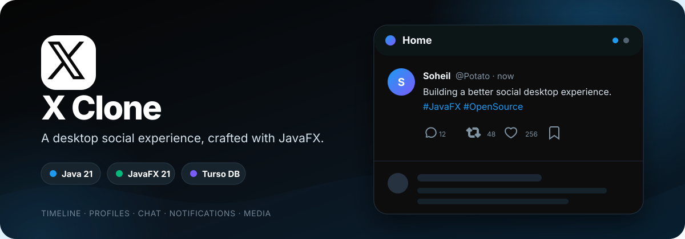
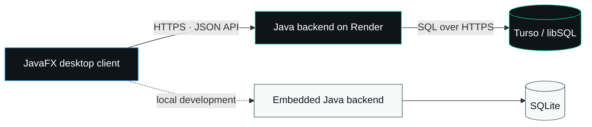

<div align="center">
  

  <br>

  [](https://github.com/Soheil-Aghayani/x-clone/actions/workflows/ci.yml)
  [](https://openjdk.org/projects/jdk/21/)
  [](https://openjfx.io/)
  [](https://maven.apache.org/)
  [](https://render.com/)
  [](https://turso.tech/)

  **A native JavaFX social app inspired by X, with a shared Java backend and Turso database.**

  [Quick start](#quick-start) · [Features](#the-experience) · [Architecture](#architecture) · [Portable build](#portable-windows-build) · [Deployment](DEPLOY-RENDER-TURSO.md)
</div>

---

## The experience

X Clone recreates the main X desktop experience in a native application. It combines a responsive JavaFX interface with real authentication and a shared social API that can run locally with SQLite or publicly on Render with Turso.

| Area | Included |
| --- | --- |
| Home | For You and Following feeds, composer, hashtags, relative timestamps, media/GIF display, and a 280-character limit |
| Profiles | Avatars, banners, bios, follower counts, post history, profile navigation, and follow controls |
| Conversations | Full post threads, nested replies, quote posts, reposts, likes, bookmarks, menus, counters, and interaction animations |
| Discovery | Notifications, mentions, search, trends, news, sports, and entertainment views |
| Chat | Passcode flow, inbox filters, message settings, and direct/group conversation layouts |
| International text | Geist 400/600 for the interface, with Vazirmatn fallback for Persian and other complex scripts |
| Desktop | Responsive JavaFX layout, X-inspired styling, and a portable Windows package |

<details>
<summary><strong>More UI details</strong></summary>

- Dynamic notification badges in the sidebar and window title
- Clickable avatars, display names, and usernames
- Optimized, durable server-hosted profile pictures, post images, and animated GIF media
- Full-screen X-style media viewer with conversation panel, navigation, loading, retry, and error states
- Character countdown warnings and disabled posting beyond the limit
- Account menu, password-visibility controls, custom dialogs, and secure chat passcodes
- Empty states for notifications, mentions, bookmarks, and conversations

</details>

## Quick start

### Requirements

- [JDK 21](https://adoptium.net/temurin/releases/?version=21)
- [Maven 3.9+](https://maven.apache.org/download.cgi)

### Run locally

```powershell
git clone https://github.com/Soheil-Aghayani/x-clone.git
cd x-clone
mvn clean javafx:run
```

The desktop app starts an embedded backend automatically. Local accounts and shared-style social data are stored in:

```text
%USERPROFILE%\.x-clone-server\xclone.db
```

Client-only preferences, drafts, chats, cached media, and the restorable session token are stored in:

```text
%USERPROFILE%\.x-clone
```

Run all automated tests with:

```powershell
mvn test
```

> [!TIP]
> If PowerShell says `mvn` is not recognized, install Maven, add its `bin` directory to `PATH`, and open a new terminal.

## Architecture



| Layer | Technology | Responsibility |
| --- | --- | --- |
| Desktop | Java 21 + JavaFX 21 | UI, navigation, local preferences, and API calls |
| API | Java HTTP server | Authentication, sessions, profiles, posts, and social interactions |
| Local data | SQLite | Zero-configuration local development |
| Cloud data | Turso / libSQL | Shared SQLite-compatible hosted database |
| Hosting | Render + Docker | Public backend deployment |
| Automation | GitHub Actions | Maven tests and Docker build validation |

## What is shared between computers?

When every desktop client uses the same public backend URL, these features are shared through Turso:

- accounts, sessions, and profiles
- posts, replies, and quote posts
- likes, reposts, and bookmarks
- follow relationships
- notifications, mentions, and read state
- uploaded post media, profile pictures, banners, and GIFs
- server-derived user search, feed discovery, suggestions, hashtags, and trends

These parts remain local to each desktop for now:

- drafts, polls, hidden/muted preferences, and temporary media cache
- chat messages, passcodes, and chat settings

> [!NOTE]
> The backend is the source of truth for the core social network. PNG and JPEG uploads are resized to a maximum 1920px dimension and compressed before Base64 database storage. GIF bytes are preserved so animations keep working. Every media file is served from a stable authenticated upload endpoint, so another computer can display it.

> [!IMPORTANT]
> The cleanup release contains a one-time database migration named `clean_start_remove_seed_accounts_v1`. On the first backend start after deployment it removes all previous accounts and social activity, then stores a completion marker. Later restarts do **not** erase newly created accounts.

## Portable Windows build

Create a package connected to the public X Clone backend:

```powershell
.\build-portable.ps1
```

The default address is `https://x-clone.alirezalotfimoghaddam.ir`. To target a different hosted backend:

```powershell
.\build-portable.ps1 -ServerUrl "https://YOUR-SERVICE.onrender.com"
```

The shareable archive is generated at:

```text
dist\X-Clone-Windows-Portable.zip
```

Recipients extract the entire folder and run `X Clone.exe`; they do not need Java, Maven, or an IDE.

## Deploy with Render + Turso

The repository contains:

- [`Dockerfile`](Dockerfile) — backend container image
- [`.github/workflows/ci.yml`](.github/workflows/ci.yml) — Maven and Docker continuous integration
- [`.env.example`](.env.example) — safe configuration template
- [`DEPLOY-RENDER-TURSO.md`](DEPLOY-RENDER-TURSO.md) — complete beginner-friendly deployment walkthrough

Backend environment variables:

| Variable | Purpose |
| --- | --- |
| `PORT` | HTTP port supplied automatically by Render |
| `TURSO_DATABASE_URL` | Hosted `libsql://` database address |
| `TURSO_AUTH_TOKEN` | Private Turso token stored in Render environment variables |
| `XCLONE_ADMIN_USERNAME` | Optional username to bootstrap as a database-backed administrator, for example `potato` |

Desktop client settings:

| Setting | Purpose |
| --- | --- |
| `XCLONE_SERVER_URL` | Optional public HTTPS URL override; defaults to `https://x-clone.alirezalotfimoghaddam.ir` |
| `server-url.txt` | Portable-build alternative to the environment variable |

> [!CAUTION]
> Keep `TURSO_AUTH_TOKEN` only in Render or a private local environment file. Never put it in the desktop app, `server-url.txt`, source code, screenshots, issues, or commits. Rotate any token that has been exposed.

Render can automatically deploy new commits after its service is connected to GitHub. GitHub Actions currently provides **CI** (tests and Docker validation); it does not independently perform a separate CD deployment.

## Project map

```text
x-clone/
├─ src/main/java/           JavaFX client and backend source
├─ src/main/resources/      fonts, icons, images, styles, and FXML
├─ src/test/                automated tests
├─ docs/                    project documentation artwork
├─ .github/workflows/       continuous integration
├─ Dockerfile               cloud backend image
├─ build-portable.ps1       Windows package builder
└─ pom.xml                  Maven project definition
```

## Contributing

Issues and pull requests are welcome. Before opening a pull request:

1. Run `mvn test`.
2. Keep credentials and tokens out of commits.
3. Include a short description and screenshots for visual changes.

---

<div align="center">
  <sub>Built with JavaFX, SQLite/libSQL, Render, and close attention to the small interactions.</sub>
</div>
