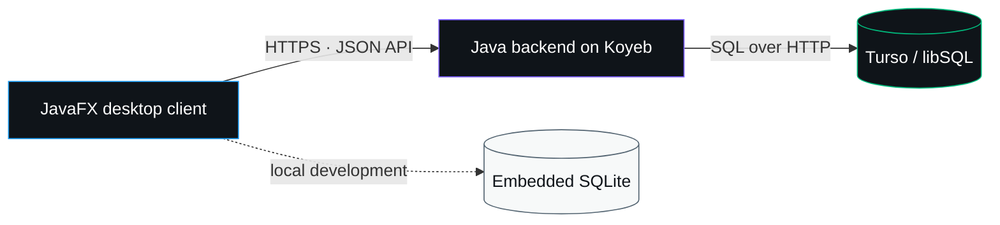

<div align="center">
  

  <br>

  [](https://github.com/Soheil-Aghayani/x-clone/actions/workflows/ci.yml)
  [](https://openjdk.org/projects/jdk/21/)
  [](https://openjfx.io/)
  [](https://maven.apache.org/)
  [](https://turso.tech/)

  **A polished desktop social experience inspired by X — built in JavaFX, ready for local development and cloud deployment.**

  [Quick start](#-quick-start) · [Features](#-the-experience) · [Architecture](#-architecture) · [Portable build](#-portable-windows-build) · [Cloud deployment](DEPLOY-KOYEB-TURSO.md)
</div>

---

## ✦ The experience

X Clone brings a familiar social feed to a native desktop application. It pairs an X-inspired interface with real authentication, rich social interactions, bilingual typography, and a backend that can run locally or on Koyeb with Turso.

| | What is included |
| :---: | --- |
| 🏠 | **Home timeline** — For You and Following feeds, live composer, media, GIFs, hashtags, relative timestamps, and a 280-character limit |
| 👤 | **Profiles** — avatars, banners, bios, follower counts, post history, profile navigation, and follow controls |
| 💬 | **Conversations** — replies, quotes, reposts, likes, bookmarks, menus, counters, and interaction animations |
| 🔔 | **Discovery** — notification center, mentions, search, trends, news, sports, and entertainment views |
| ✉️ | **Private chat** — passcode flow, inbox filters, message settings, and NPC-only automatic replies |
| 🌐 | **International text** — Chirp for Latin text and Vazirmatn for Persian and other complex scripts |
| 🖥️ | **Desktop-ready** — responsive JavaFX layout, light X-inspired styling, and a portable Windows package |

<details>
<summary><strong>More UI details</strong></summary>

- Dynamic notification badges in the sidebar and window title
- Clickable avatar, display name, and username navigation
- Profile-picture fallbacks and animated GIF media
- Character countdown warnings, disabled posting beyond the limit, and hashtag styling
- Account menu, password-visibility controls, custom dialogs, and secure chat passcodes
- Empty states for notifications, mentions, bookmarks, and conversations

</details>

## ⚡ Quick start

### Requirements

- [JDK 21](https://adoptium.net/temurin/releases/?version=21)
- [Maven 3.9+](https://maven.apache.org/download.cgi)

### Run from source

```powershell
git clone https://github.com/Soheil-Aghayani/x-clone.git
cd x-clone
mvn clean javafx:run
```

The app starts an embedded backend automatically in local mode. Accounts are stored in:

```text
%USERPROFILE%\.x-clone-server\xclone.db
```

Run the test suite with:

```powershell
mvn test
```

> [!TIP]
> If PowerShell says `mvn` is not recognized, install Maven and add its `bin` directory to `PATH`, then open a new terminal.

## ◇ Architecture



| Layer | Technology | Responsibility |
| --- | --- | --- |
| Desktop | Java 21 + JavaFX 21 | UI, navigation, local state, and API calls |
| API | Java HTTP server | Authentication, sessions, and backend endpoints |
| Local data | SQLite | Zero-configuration local development |
| Cloud data | Turso / libSQL | Shared SQLite-compatible hosted database |
| Hosting | Koyeb + Docker | Public backend deployment |
| Automation | GitHub Actions | Maven tests and Docker build validation |

## 📦 Portable Windows build

Create a local-only package:

```powershell
.\build-portable.ps1
```

Create a package connected to a hosted backend:

```powershell
.\build-portable.ps1 -ServerUrl "https://YOUR-SERVICE-YOUR-ORG.koyeb.app"
```

The shareable archive is generated at:

```text
dist\X-Clone-Windows-Portable.zip
```

Your recipient can extract it and launch the app without installing Maven.

## ☁️ Deploy with Koyeb + Turso

The repository already includes everything needed for deployment:

- [`Dockerfile`](Dockerfile) — production backend image
- [`.github/workflows/ci.yml`](.github/workflows/ci.yml) — Maven and Docker CI
- [`.env.example`](.env.example) — safe configuration template
- [`DEPLOY-KOYEB-TURSO.md`](DEPLOY-KOYEB-TURSO.md) — complete deployment walkthrough

Backend environment variables:

| Variable | Purpose |
| --- | --- |
| `PORT` | HTTP port supplied by Koyeb |
| `TURSO_DATABASE_URL` | Hosted `libsql://` database address |
| `TURSO_AUTH_TOKEN` | Turso token stored as a Koyeb Secret |

Desktop client settings:

| Setting | Purpose |
| --- | --- |
| `XCLONE_SERVER_URL` | Public Koyeb HTTPS URL |
| `server-url.txt` | Portable-build alternative to the environment variable |

> [!CAUTION]
> Keep `TURSO_AUTH_TOKEN` only in Koyeb Secrets or a private local environment file. Never place it in the desktop client, source code, screenshots, issues, or commits.

## 🗂️ Project map

```text
x-clone/
├─ src/main/java/           JavaFX client and backend source
├─ src/main/resources/      fonts, icons, images, styles, and FXML
├─ src/test/                automated tests
├─ docs/                    project documentation artwork
├─ .github/workflows/       continuous integration
├─ Dockerfile               cloud backend image
├─ build-portable.ps1       Windows package builder
└─ pom.xml                  Maven project definition
```

## 🚧 Shared-network status

Authentication and sessions are connected to the shared backend. Posts, follows, notifications, chat messages, and media currently use desktop-local stores.

> [!IMPORTANT]
> To make every installed client see one complete shared social network, the remaining social data must be moved behind authenticated backend APIs. This is the next major backend milestone.

## 🤝 Contributing

Issues and pull requests are welcome. Before opening a pull request:

1. Run `mvn test`.
2. Keep secrets out of commits.
3. Include a short description and screenshots for visual changes.

---

<div align="center">
  <sub>Built with JavaFX, SQLite/libSQL, Koyeb, and a lot of attention to the small interactions.</sub>
</div>
